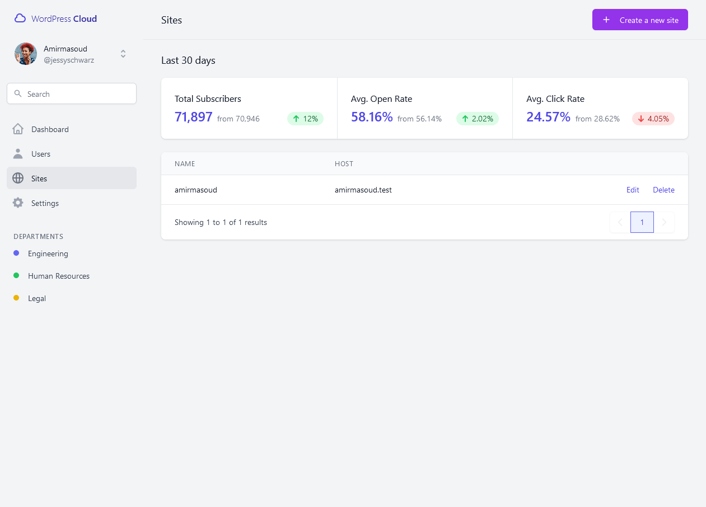
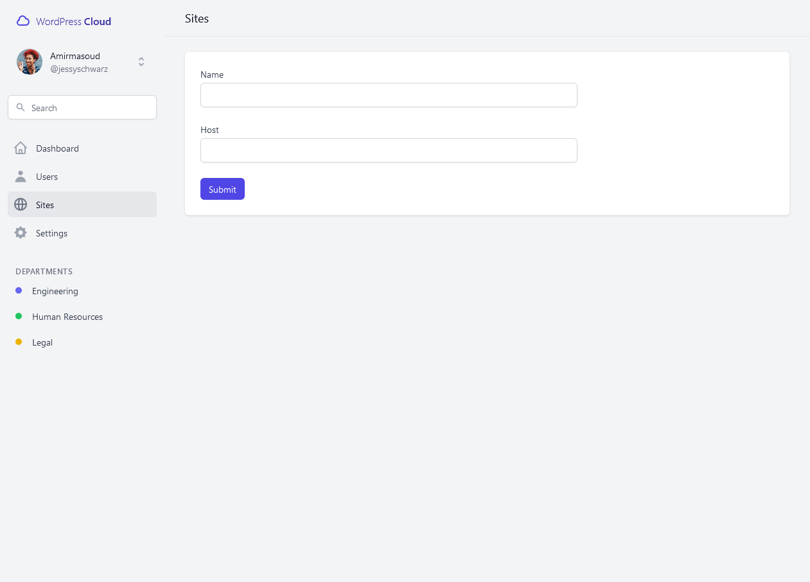

# Cloud

## Proxy
The proxy is where Traefik docker container will be along with the certificates and other configurations related to that.

## Sites
The `sites` is the home of WordPress sites along with their individual configurations.

## Spinner
The `spinner` is the Laravel application responsible to create, monitor and edit the WordPress sites. 

### Roadmap

- [ ] Install WP CLI into containers on demand
- [ ] Create templates for WordPress containers to install specific themes/plugins after container start
- [ ] Handle other type of SSL certificates
- [ ] Monitor container status along with their logs
- [ ] Use official WordPress images along with different MySQL versions
- [ ] Monitor/Manage WordPress containers RAM/CPU/Storage limits
- [ ] Manage/Limit WordPress mail servers
- [ ] Alert/Notification on stopped containers
